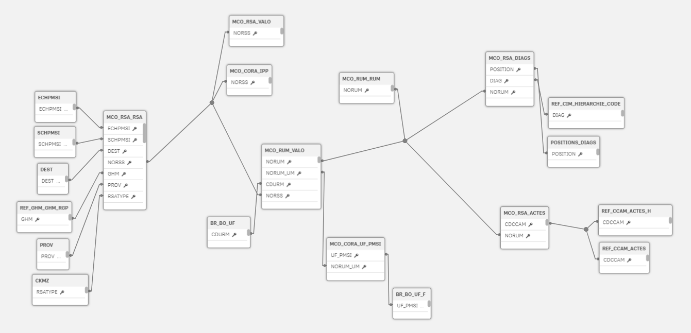

# schema_pmsi

### Amorce d'un schéma contour MCO à partir des RSA et RUM d'un établissement de santé (ici CHRU de Brest)

- intègre la valorisation T2A au niveau RSA et ventilation RUM
- Intégration dans base de données (ici oracle) des tables au format ministériel avec l'aide du package pmeasyr
- ajout des principaux référentiels PMSI (CIM, CCAM, GHM, GHS)
- récupération dans le système d'information (ici base oracle de l'outil Cora) de données comme l'IPP et les passages UF pour enrichir les dimensions
- récupération dans le système d'information local des différents niveaux structures (pole, service, um, uf) et de leurs libellés 
